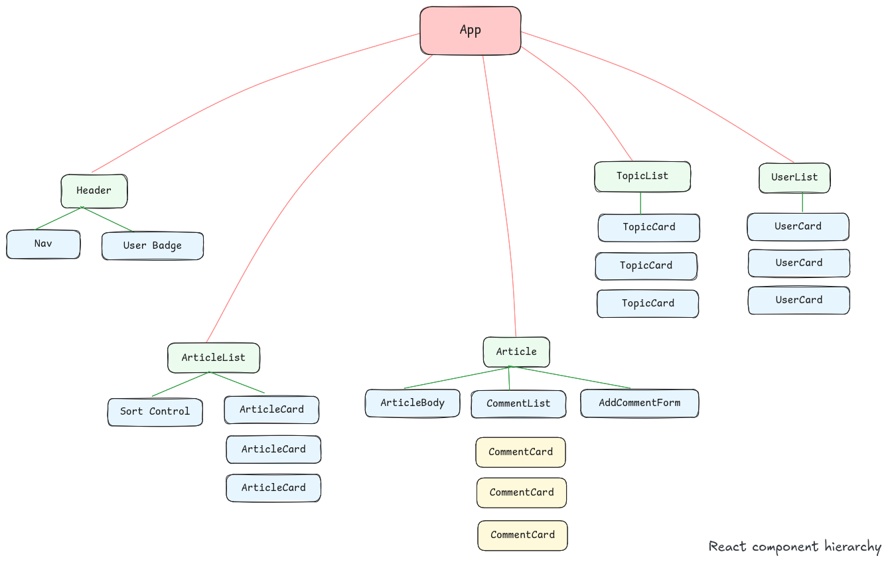
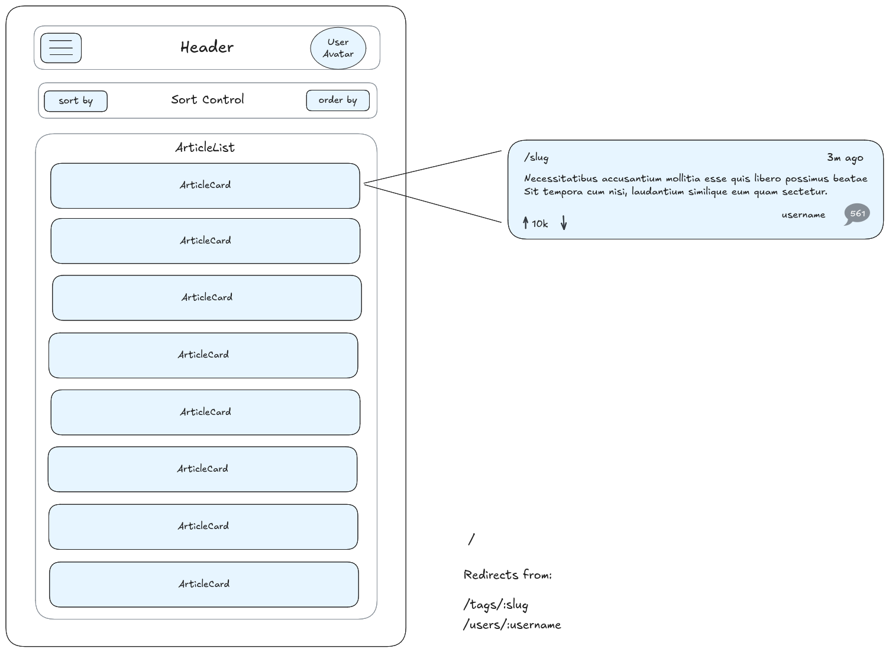
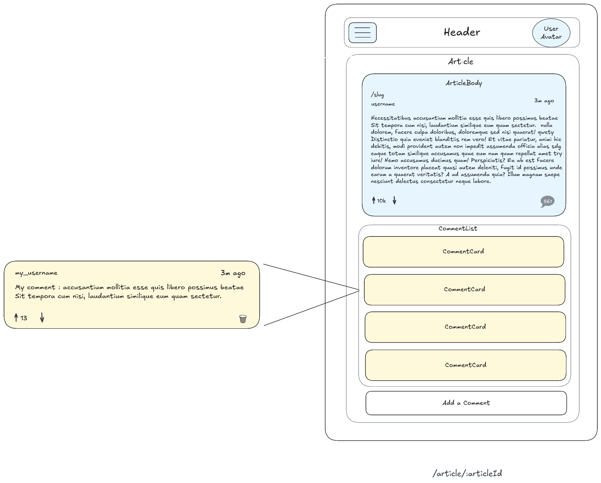
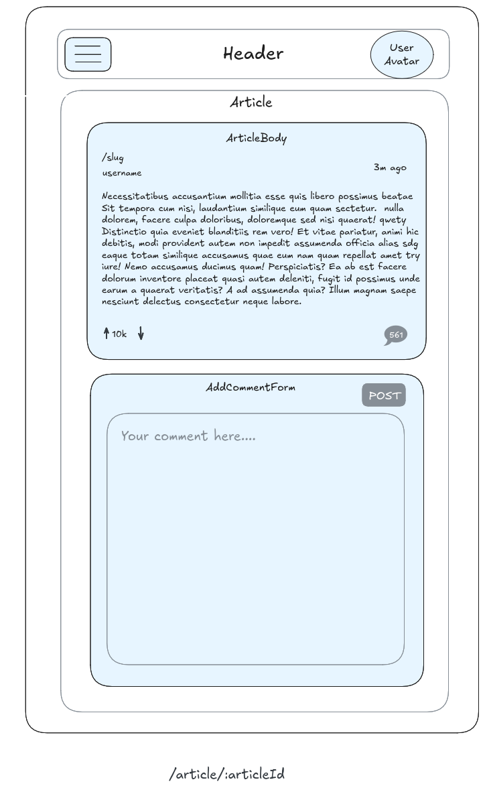
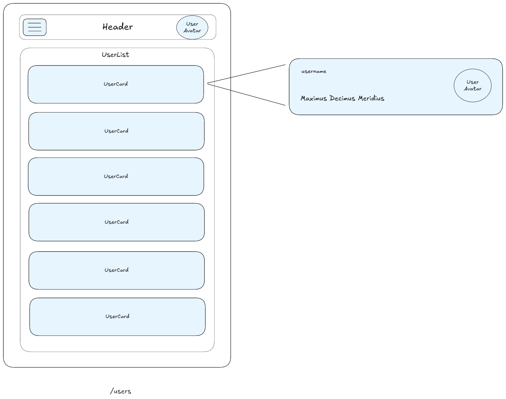
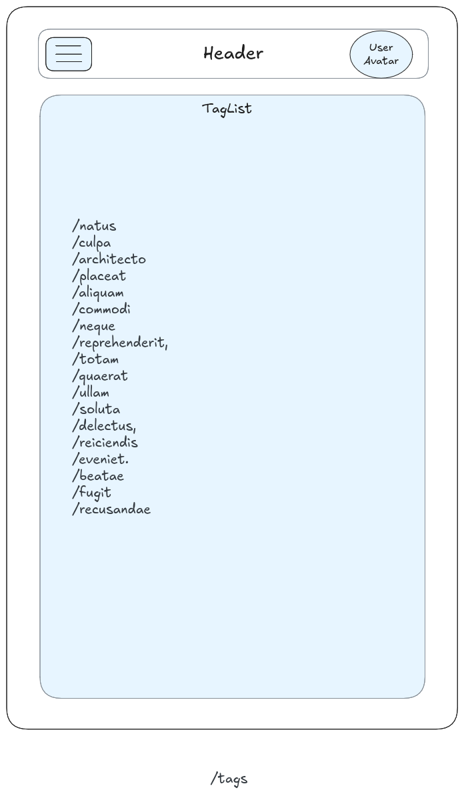

# Subnet - frontend

A React.js frontend for my backend web service [here](https://github.com/harrychopra/subnet-be).

## User stories - (Within scope of CORE)

- **Header** - persistent across all views

  As a user:

  - [ ] I can see the site name and logo
  - [ ] I can click navigation links to go to Home, Topics, and Users
  - [ ] I can see my active profile as an avatar and username in the header
  - [ ] I can click my avatar to navigate to my profile page

- **Home / Article List** view

  Uses: `GET /api/articles`, `GET /api/articles (sort queries)`

  As a user:
  - [ ] I can see a list of all articles, each showing: title, author, topic, date, vote count, and comment count
  - [ ] I can sort articles by date, comment count, or votes in ascending or descending order
  - [ ] I can click on an article's topic and see a list of all articles tagged with it
  - [ ] I can click on an author and navigate to their profile page

- **Single Article** view

  Uses:`GET /api/articles/:article_id`,`GET /api/articles/:article_id/comments`,`PATCH /api/articles/:article_id`,`POST /api/articles/:article_id/comments`,`DELETE /api/comments/:comment_id`

  As a user:

  - [ ] I can read the full article body
  - [ ] I can up vote or down vote the article
  - [ ] I can see the total comment count for the article
  - [ ] I can see all comments on the article, including who wrote each one and when
  - [ ] I can up vote and down vote a comment. I cannot up vote or down vote my own comment.
  - [ ] I can post a new comment on the article
  - [ ] I can delete my own comments
  - [ ] I can click on article's topic and see a list of all articles tagged with it
  - [ ] I can click on author in comment list or article and navigate to their profile page

- **Topic List** view

  Uses: `GET /api/topics`

  As a user:

  - [ ] I can see a list of all topics
  - [ ] I can click a topic to see all articles tagged with it

- **User List/ First time login** view

  Uses: `GET /api/users`

  As a user:

  - [ ] I can see a list of all users, each showing their avatar and username
  - [ ] I can click on a user and switch my active session
  - [ ] I can return to the website with the last active session

- **Single User** view

  Uses: `GET /api/users/:username`

  As a user:

  - [ ] I can see a user's avatar, username, and name
  - [ ] I can click on any username across the app and be taken to their profile

## React components

## Views

### Home page/ All Articles

### Single Article

**Add Comment Form**

### List of users

### List of tags

## Stretch Goals

- **Header** with navigation across all views

  As a user:

  - [ ] I can see the site name and logo
  - [ ] I can click navigation links to go to home, topics and users
  - [ ] I can see my active profile as an avatar and username
  - [ ] I can click on the my avatar to navigate to my profile page

- **Home/ Article list** view

  As a user:

  - [ ] I can see a list of all articles each with its title, author, topic, date, vote count and comment count.
  - [ ] I can click a sort link to open a modal with sorting options
  - [ ] I can sort list of articles by date, comment count, or votes in ascending or descending order
  - [ ] I can click on an article's topic and see a list of all articles tagged with it
  - [ ] I can click on an author and navigate to their profile page

- **Single Article** article view

  As a user:

  - [ ] I can read the full article body
  - [ ] I can click to up or down vote the article
  - [ ] I can see all comments on the article
  - [ ] I can see who wrote each comment and when
  - [ ] I can click on the article's topic and see a list of all articles tagged with it
  - [ ] I can click on the author and navigate to their profile page
  - [ ] I can post new comments on the article
  - [ ] I can delete my own comments
  - [ ] I can see the comment count update as I post or delete a comment

- **Topic list** view

  As a user:

  - [ ] I can see a list of topic sorted by name
  - [ ] I can see count of articles existing for each topic
  - [ ] I can click a topic and see all articles tagged with it

- **User list** view

  As a user:

  - [ ] I can see a list of all users with their avatar and username
  - [ ] I can see how many articles and comments each user has written
  - [ ] I can click a user to view their profile

- **Single User** view

  As a user:

  - [ ] I can see the user's avatar, username and profile information
  - [ ] I can see a count of articles and comments attributed to the user
  - [ ] I can click on articles link and see a list of articles written by the user
  - [ ] I can click on comments link and see a list of comments written by the user
  - [ ] I can switch my active session to the user
